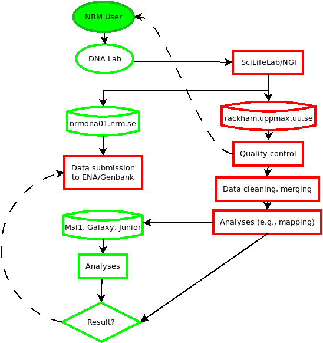

# NRM DNA lab

- Last modified: tor aug 31, 2023  12:35
- Sign: JN

---

## Personal checklist to get started

- [ ] Account on GitHub (<https://github.com/>)
- [ ] Member of Naturhistoriska organization
  (<https://github.com/Naturhistoriska>) (Fill out
  [Bestallningsblankett-2017-V2.pdf](doc/Bestallningsblankett-2017-V2.pdf)
  (don't forget your GitHub user name) and send to Dept. head. Tell JN when
  approved.)
- [ ] MobaXterm, PuTTY, or (recommended) WSL2 installed on your NRM Windows
  machine (<https://learn.microsoft.com/en-us/windows/wsl/install>)
- [ ] Accounts on Msl1.nrm.se, Galaxy.nrm.se, Junior.nrm.se (ask JN)
- [ ] Account on nrmdna01.nrm.se (ask NRM IT. You need to provide "your public
  ed25519 SSH key" (see [ssh.md](doc/ssh.md) or ask JN))
- [ ] Functioning (NRM) VPN client if working remotely (consult NRM IT)
- [ ] Personal account on uppmax
  (<https://www.uppmax.uu.se/support/getting-started/applying-for-a-user-account/>).
  Here is a link for practicing working on uppmax resources:
  <https://uppsala.instructure.com/courses/67267>.
- [ ] Member of projects `p_nrmdnalab_storage` and `p_nrmdnalab` on rackham
  (uppmax, ask JN or BC)
- [ ] Start to learn and use documentation in [Markdown
  syntax](https://www.markdownguide.org/getting-started/).

---

## Standard data flows

### 1. Securing meta data from user

Meta data about the samples. This information in crucial in the workflows, and
will be used in the submission step.

A sample template for submitting data to ENA can be downloaded through ENA's
[Webin
portal](https://ena-docs.readthedocs.io/en/latest/submit/general-guide/submissions-portal.html) 

The use of the Webin portal (<https://www.ebi.ac.uk/ena/submit/webin/login>)
requires registration (adding e-mail addresses for users), and the NRM DNA-lab
have an account (**Webin-65361**. Ask around for the password).

1. Log in to the Webin portal, and under `Samples`, click on `Register
   Samples`. On the next page, click on `Download spreadsheet to register
   samples`.
2. For a "standard" analysis (e.g. WGS from several samples), choose `Other
   Checklists`. Then the `ENA default sample checklist` would be appropriate
   for most studies.
3. Select the fields applicable. Pay attention to the mandatory fields and the
   section of Optional Fields. Some/many of the Optional fields can be vary
   valuable to collect in one place.). Then click on `Next`, followed by
   `Download TSV Template`.  An example of the minimal ENA sample tsv template
   file (ons 30 aug 2023 13:10:40) can be found here:
   [`ENA-default_sample_checklist.tsv`](doc/ENA-submission/ENA_default_sample_checklist.tsv),
   and a submitted sample checklist can be found here:
   [`ENA_sample_checklist_Azure.tsv`](doc/ENA-submission/ENA_sample_checklist_Azure.tsv).
4. Open the file in, e.g., Excel and add samples.

Detailed information for each field can be found in the step 3. above.

**Important**
- For `Sample alias`, don't use special characters or white space
- New taxon? Use a place-holder name, e.g., `Genus sp_nov_1`. More details on
  new taxa can be found here:
  <https://ena-docs.readthedocs.io/en/latest/faq/taxonomy_requests.html>.
- [TODO: provide more detailed advise]()

#### Documentation

- <https://ena-docs.readthedocs.io/en/latest/submit/general-guide.html>
- <https://ena-docs.readthedocs.io/en/latest/submit/general-guide/metadata.html>

### 2. Ordering sequences from SciLifeLab/NGI

<https://ngisweden.scilifelab.se/>

- Text 1
- Text 2

### 3. Data download from NGI to NRM-backup using DDS

Links

- <https://ngisweden.scilifelab.se/resources/data-delivery-dds/>
- <https://scilifelabdatacentre.github.io/dds_cli/>

Steps

- Login to `nrmdna01.nrm.se` using your NRM credentials
- Change to relevant directory (create one if necessary). Note: the current
  folder structure on the server is
  `/projects/<dept>-projects/<PI-NRM-username>`. The PI may, or may not already
  have an account on the server, and may, or may not know how to create folders
  etc.
- Make sure the `dds-cli` is available (otherwise install in your `$HOME/bin/`.
  Note: easiest is probably to download the latest binary release for Ubuntu
  20.04 (see link on <https://github.com/ScilifelabDataCentre/dds_cli/releases>
  saying "`dds_cli_ubuntu-20.04_x86_64`", then rename it to `$HOME/bin/dds`,
  and finally `chmod +x $HOME/bin/dds`)
- Start a screen session (`screen -S name`)
- Run the client to download data. Detach from the screen session if needed
  (`Ctrl+A`, `Ctrl+D`)
- Revisit the server later, reconnect to the screen session (`screen -R name`)
- Check md5 sums (<https://github.com/nylander/Check_MD5SUMS>. You most
  probably want to download the script `check_md5sums.sh`, put it in your
  `$HOME/bin`, and make it executable.)
- Exit the screen session  (`exit`)
- If you have created a folder for a PI, then the user- and group permissions are set to you.
Make sure others have read permissions to all files and folders. For example:

        $ chmod -R o+r /projects/BIO-projects/piname
        $ find /projects/BIO-projects/piname -type d -exec chmod o+rx {} \;

### 4. Data download from NGI to rackham

Links

- <https://ngisweden.scilifelab.se/resources/data-delivery-dds/>
- <https://scilifelabdatacentre.github.io/dds_cli/>

Steps

- If the PI have a storage and/or compute account on rackham, make sure to be
  added to the project (apply on <https://supr.naiss.se>). Otherwise, make sure
  you have access to `/proj/nrmdnalab_storage`.
- Check before you start that there are still storage space left (check with
  `uquota`).
- Create a new project folder (e.g., under
  `/proj/nrmdnalab_storage/nobackup/`). One way of doing that can be seen in
  this example (**Need `ptemplate`**
  <https://gist.github.com/nylander/beff8f66d3b5c30c6c3ec732688e5373>:
  `ptemplate myproject`
- Change directory to where the data should be downloaded (e.g. `raw_data`)
- Load the `dds` program using the rackham module system: `module load
  bioinfo-tools dds-cli`
- Start the client: `dds`

### 5. Quality Control of Illumina data

- Check data QC information from NGI
- Run our own data QC (see also below)
- Text

### 6. Data cleaning, merging, etc

Note: this step may or may not be necessary depending on the choice of
downstream analyses. See, e.g., "Analyses (e.g., mapping)"

<https://github.com/nylander/fastp-cleaning>

- Text 1
- Text 2

#### 6.2. Working with links

After the cleaning, we can create links to the cleaned data (instead of
copying) each time we need to re-use them for a task.  At this stage (*if* we
have made md5sum-verified backups), we can also delete the raw data.

Create (symbolic/soft) links from the folder in `$DIR` to the current working directory:

    $ mkdir -p /path/to/folder/where/links/are/to/be/created
    $ cd /path/to/folder/where/links/are/to/be/created
    $ find /path/to/folder/whith/fastq.gz/files/ -type f -name '*.fastq.gz' -exec ln -s {} . \;

### 7. Analyses

#### 7.1. Create a data sheet from the sequence delivery

Many workflows require a data sheet for specifying input data. This script
[create_sample_sheet.pl](https://gist.github.com/nylander/287d1f47c669a350c2e7b97a3da58df5#file-create_sample_sheet-pl)
can help as a start. Steps:

0. Download the script and view options (`create_sample_sheet.pl --help`)
1. Change directory to the delivery folder (e.g., `cd P27213`)
2. Assuming there is a file `00-Reports/*_sample_info.txt`, run the script:
        $ create_sample_sheet.pl 00-Reports/*_sample_info.txt > sample_sheet.tsv
3. Go through the output (`sample_sheet.tsv`), and edit as needed.

#### 7.2. Short-read mapping to reference

We have used, to some success, the nf-co.re/eager
(<https://github.com/nf-core/eager>)  pipeline for this task. It was tailored
for low-quality or ancient DNA, but can be used for fresh material (Illumina
fastq) as well.  The workflow includes a cleaning and filtering step, so raw
data can be used as input.

- Prepare a sample sheat ([example](doc/eager-data.tsv))
- Visit <https://nf-co.re/eager>
- Text 1
- Text 2

### 8. Copy files from rackham to NRM computers

The best strategy is to log in to a NRM computer, and then "drag" the files
from rackham. The preferred tools are either `rsync` or `scp`.  In order for
scp to work smoothly, passwordless ssh should be set up between the computers.
See [ssh.md](doc/ssh.md).

#### scp

Example when logged in to `msl1.nrm.se`: transfer one file from rackham to
current working directory.

    [msl1]$ scp usernameonrackham@rackham.uppmax.uu.se:/proj/nrmdnalab_storage/nobackup/metadata.txt .

#### rsync

Example when logged in to `msl1.nrm.se`: transfer one directory (with all
content, recursively) from rackham to current working directory.

    [msl1]$ rsync -avh usernameonrackham@rackham.uppmax.uu.se:/proj/nrmdnalab_storage/nobackup/my_folder .

**Note** The command above will transfer any content of `my_folder` from
rackham to msl1. If the folder doesn't already exist on msl1, it will be
created.  A subtle change in behaviour can be made (see traling `/` on the
source directory in the example below), in order for all files in `my_folder`
to be transferred, but not the folder itself!

    [msl1]$ rsync -avh usernameonrackham@rackham.uppmax.uu.se:/proj/nrmdnalab_storage/nobackup/my_folder/ .

The second syntax is commonly used when, say, you already have `my_folder` in
both locations, but you want to transfer all files added in the rackham copy to
msl1. Again, and example:

    [msl1]$ rsync -avh usernameonrackham@rackham.uppmax.uu.se:/proj/nrmdnalab_storage/nobackup/my_folder/ my_folder

### 10. Data submission to public databases

- INSDC <https://www.insdc.org/>
- Genbank <https://www.ncbi.nlm.nih.gov/genbank/submit_types/>
- ENA <https://www.ebi.ac.uk/ena/browser/submit>
- ENA Webin-CLI <https://ena-docs.readthedocs.io/en/latest/submit/general-guide/webin-cli.html>
- Example [ENA-submission of raw reads](doc/ENA-submission/README.md)

